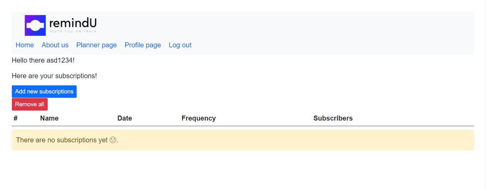
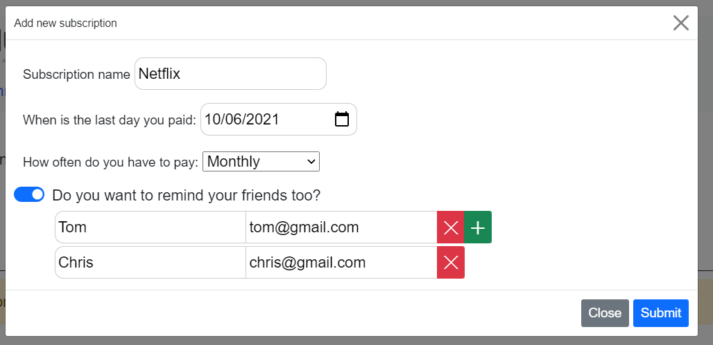
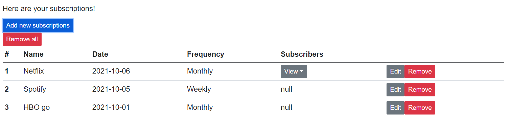

# remindU-
**RemindU is a web application that sends reminders for when to pay for subscriptions, made by using PHP, SQL, JavaScript, HTML, CSS**
## Short description of the project
* First you need to create an account. Here is the home page of the site:

* In your account will be saved all your subscriptions:

* You can add/remove/edit your subscriptions:

* And here is your subscription table:

